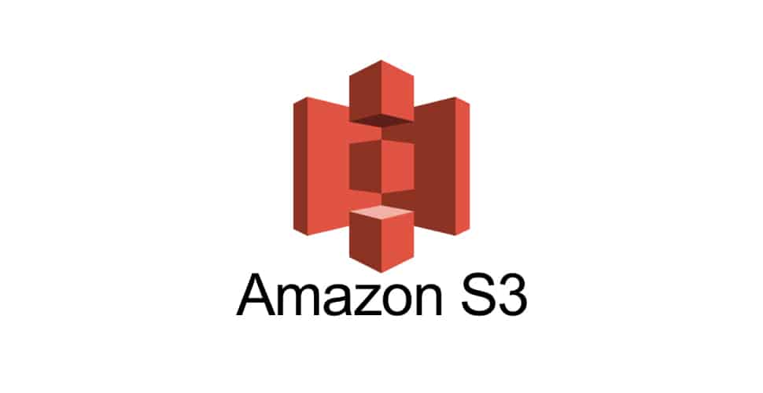
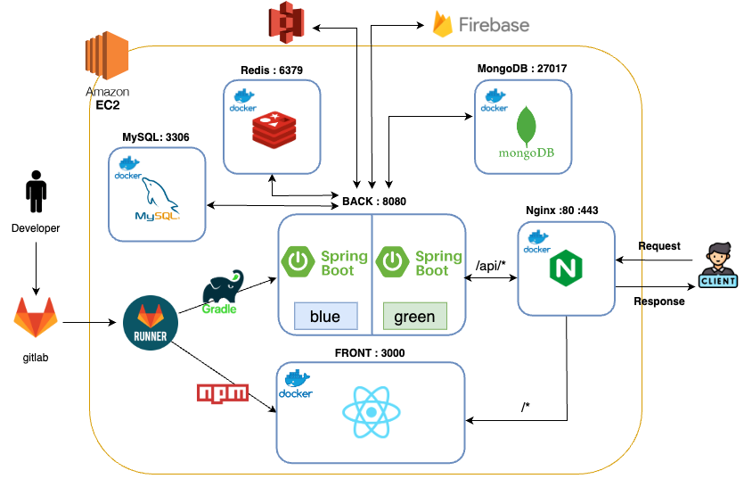
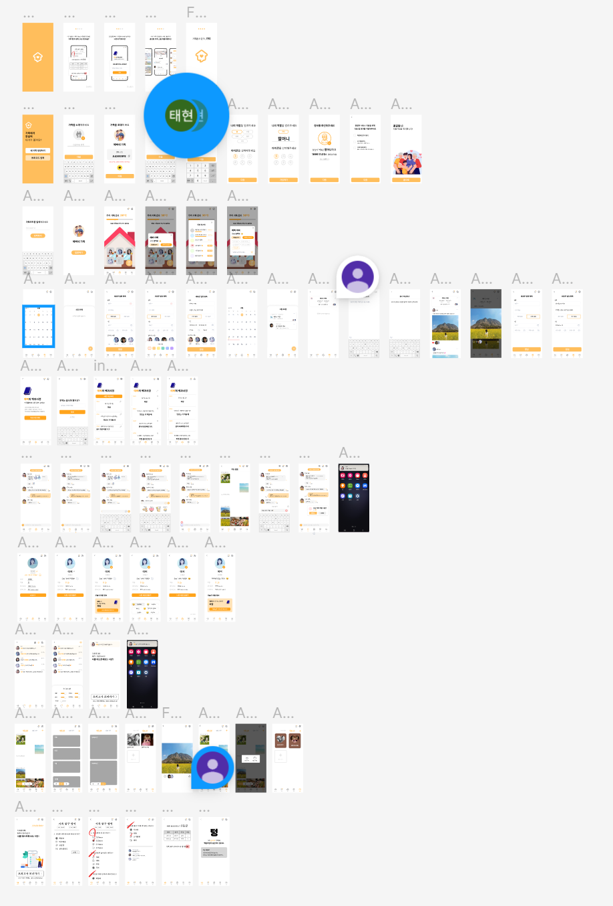
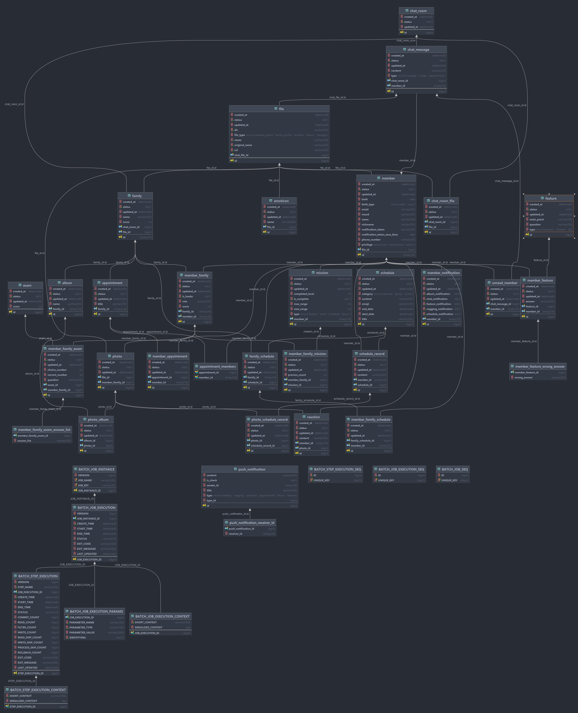
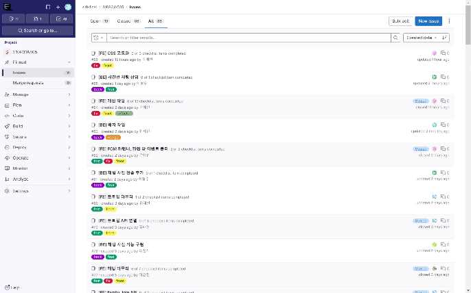

# 목차

1. [서비스 소개](#🏡서비스-소개)
2. [기획 배경](#👨‍👨‍👧‍👦기획-배경)
3. [UCC](#ucc)
3. [화면소개](#❤️-화면-소개)
4. [기술 스택](#💙-기술-스택)
5. [서비스 아키텍처](#👨‍👦-서비스-아키텍처)
6. [프로젝트 산출물](#👩‍👧-프로젝트-산출물)

---

# 🏡서비스 소개

# UCC
- ucc 추가
## 서비스 설명

### 개요

- 현대 사회는 맞벌이, 교육, 개인주의의 심화 등의 이유로 가족 간의 소통이 단절
- 소원해진 가족 관계,  **가족 SNS 서비스 “가티”** 를 이용해 가까워져보자
- 가족들 간의 소통을 활성화하고 추억을 기록할 수 있게 함으로써 이를 개선해 보고자 함
- 서비스 명 : **Gatee(가티)**

### 타겟 🎯

- 맞벌이, 교육 등의 이유로 서로 간 유대감이 떨어진 가족들
- 자식들과 가까워지고 싶지만 어디서부터 다가가야할지 모르겠는 부모님들
- 부모님과 가까워지고 싶지만 따뜻한 말을 먼저 건내기 어려워하는 자녀들
- 서먹해진 가족과의 관계를 개선하고 싶은 사람들 누구나 ~

## UCC 🎞️

# 👨‍👨‍👧‍👦기획 배경

## 배경

미디어의 발전, 사춘기, 바쁜 현실 등의 이유로 심화된 가족 간의 개인주의… 팍팍한 현대 사회는 가족 간의 소통이 단절되어 있습니다. “어머니는 짜장면이 싫다고 하셨어” 정말 싫으셨을까요? 어머니는 사실 짜장면을 좋아하셨답니다. 이렇듯 부모님이, 그리고 내 자녀가 어떤 것을 좋아하고 어떤 것을 즐겨하는지 우리는 잘 모릅니다. 직접 물어보기도 민망하죠. 

서로에 대해서 알아준다면 좋겠지만, 표현하기는 어려울 때가 많을 겁니다. ‘사랑합니다’라는 말 한 마디가 간단하면서도 입으로 전하기엔 어렵습니다. 이럴 때 ‘누군가’가 내 마음을 대신 전해 준다면 얼마나 좋을까요. 저희는 

## 목적 🥅

가족 소통을 위한 올인원 서비스를 사용하여 가족 관계를 개선하자

## 의의

1. **서로에 대한 이해 증진**: 가족 구성원들이 서로의 취향, 관심사, 그리고 일상 생활에 대해 더 잘 알 수 있게 도와줍니다. 이를 통해 가족 간의 오해를 줄이고 더 깊은 이해와 공감을 형성할 수 있습니다.
2. **정서적 유대 강화**: 일상 속에서 소소한 감정과 생각을 공유함으로써 가족 구성원 간의 정서적 유대를 강화합니다. 이는 가족 구성원들이 더 큰 안정감과 소속감을 느끼게 합니다.
3. **효율적인 소통 도구 제공**: 바쁜 현대 사회에서 가족들이 쉽게 소통할 수 있는 효율적인 도구를 제공하여, 물리적인 거리나 시간의 제약 없이 언제 어디서나 소통할 수 있게 합니다.
4. **가족 추억 기록**: 가족 구성원들이 함께 만든 추억을 기록하고 저장할 수 있는 공간을 제공하여, 시간이 지나도 소중한 순간들을 되돌아보고 기억할 수 있게 합니다.
5. **갈등 완화 및 해결**: 가족 간의 갈등 상황에서 중재 역할을 할 수 있는 기능을 제공하여, 갈등을 신속하고 효과적으로 해결할 수 있게 돕습니다.
6. **가족 행사 및 이벤트 관리**: 생일, 기념일 등 중요한 가족 행사를 체계적으로 관리할 수 있는 기능을 제공하여, 중요한 순간을 놓치지 않고 함께 축하할 수 있게 합니다.
7. **긍정적 가족 문화 조성**: 가족 간의 적극적인 소통과 상호작용을 통해 긍정적이고 건강한 가족 문화를 조성하고 유지할 수 있게 합니다.

---

# ❤️ 화면 소개

### 1. 로그인 / 회원가입
### 2. 메인 화면

### 3. 한마디 하기 

### 4. 백과사전 - 서재에서 내 사전 작성하는 화면
### 5. 모의고사 - 문제 푸는 화면, 문제풀고 나서 결과 페이지, 가족별 성적표
### 6. 채팅 - 채팅, 사진 업로드, 이모티콘 전송, 약속
### 7. 알림 - 알림 동의목록 보여주고 일정 등록 알림 받고 일정 페이지로 이동
### 8. 일정 - 일정 보기 후 일정 등록
### 9. 앨범 - 사진 등록 후 앨범에 추가, 사진 상세, 상호작용
### 10. 미션 - 미션 리스트에서 하러가기 버튼 누르기
### 11. 프로필 수정

# 💙 기술 스택

---

## 1. Firebase

### (1) Firebase Realtime Database
Google의 Firebase 플랫폼에서 제공하는 NoSQL 기반의 실시간 데이터베이스 서비스로 모바일 및 웹 애플리케이션에 실시간 데이터 동기화 및 데이터베이스 관리 기능을 제공합니다.
### 적용

### (2) Firebase Cloud Messanger

FCM은 Google의 Firebase 플랫폼에서 제공하는 푸시 알림 서비스로, 대규모의 메시지를 신속하게 전송할 수 있는 고성능 메시징 엔진을 제공합니다. 이를 통해 빠르고 효율적인 푸시 알림 서비스를 구축할 수 있습니다. 

### 적용

- **푸시 알림 발송**

    사용자 기기에 부여되는 고유한 토큰을 활용하여 알림을 발송합니다. 일정 등록, 사진 등록, 한마디 보내기, 채팅 서비스, 한줄 정보 서비스 알림 수신 동의시, 사용자의 기기에 푸시 알림이 발송됩니다. 서비스와 관련된 정보를 데이터 페이로드에 추가히여 푸시 알림을 수신받은 사용자의 추후 동작을 처리할 수 있습니다.

- **토큰 관리**

    FCM 서비스 내에서 자체적으로 토큰이 관리되지 않기 때문에, 별도로 토큰의 신선도를 유지하는 로직을 추가하였습니다. 메인 화면 도달시 토큰을 업데이트합니다. 푸시 알림 발송시 UNREGISTERED 등의 토큰 관련 에러 발생시 토큰을 제거합니다. 배치 작업을 통해 2개월 이상 토큰이 업데이트 되지 않은 유저들의 토큰을 제거합니다.
- **메세지 수신**

  브라우저가 백그라운드에서 실행시키는 스크립트인 서비스워커를 사용하여 알림 수신 기능을 구현하였습니다. 앱의 백그라운드에서 Firebase 앱을 초기화하고 이벤트를 수신합니다. 또한, 앱에 접속 중이거나 채팅방에 접속 중일 때는 채팅 알람을 받지 않도록 직접 구현한 컴포넌트를 활용하여 알림을 표시합니다.
  
   

## 2. Redis

> Redis는 주로 애플리케이션 캐시나 빠른 응답 속도를 가진 데이터베이스로 사용되는 오픈 소스 인메모리 NoSQL 저장소 입니다.

### 적용

- **JWT Token을 사용한 로그인**
    
    로그인 시 사용되는 Refresh-token을 저장하기 위해서 사용하였으며 보안성을 강화하기 위해서 엑세스 토큰 갱신 시에 리프레시 토큰도 같이 갱신되는 `Refresh Token Rotation` 방식을 채용하였습니다.
    
- 채팅에 참여하고 있는 회원 세션 관리
    
    채팅창에 들어온 사용자를 Redis Repository의 리스트 객체로 관리하여, 채팅에 참여하고 있는 회원을 분류하고 읽음 횟수를 구현했습니다.
    
    WebSocket 연결 시점에 사용자를 리스트에 추가하고 연결이 끊기면 리스트에서 제거하여, 채팅 참여 여부를 실시간으로 추적했습니다.
    
    UnRead 상태인 사용자가 WebSocket에 연결되면 리스트에서 제거하고, reading count에 반영하여 읽음 처리를 수행했습니다.
    
- **Spring Batch Scheduler Lock**
    
    여러 서버가 스케줄된 같은 시간에 Database에 접근해 Update 작업을 실행하면 데이터의 일관성과 무결성을 해칠 수 있기 때문에 `ShedLock` 라이브러리를 활용했습니다.
    
    한 서버에서 스케줄된 `Job` 이 실행되면 Redis에 해당 실행 정보를 넣어 작업 수행 최대 시간만큼 유지되게 하여 작업 수행 전 Redis에 정보가 있으면 `Job`을 수행하지 않게 하였습니다.
    
- 가족 합류 시 사용되는 가족 코드 관리
    
    

## 3. Amazon S3

> AmazonS3는 주로 웹 서비스를 위한 온라인 파일 저장소로 사용되는 클라우드 스토리지 서비스입니다.
> 
> 
> Gatee는 S3를 통해 사용자가 프로필, 채팅 등에서 사용하는 이미지들을 관리합니다.
> 

### 적용

- 사용자가 업로드하는 사진들을 크롭하여 S3에 저장하고 관리합니다.
- 사진 로드하거나 업로드할때 s3에 활용하는거 좀 더 추가

## 4. Open AI ChatGPT

> OpenAI의 ChatGPT는 다양한 주제에 대해 즉각적인 답변, 창의적인 영감, 그리고 학습 기회를 제공하는 도구입니다.
> 
> 
> Gatee는 생성형 AI를 통해 사용자가 “한마디 보내기” 기능을 사용할때 말을 순화하거나, 사용자가 작성한 “백문백답”을 기반으로 모의고사 문제를 생성합니다.
> 

### 적용

- Model

    GPT-3.5-turbo는 고급 자연어 처리(NLP)능력을 보유하고 있어 다양한 주제에 대해 자연스럽고 흥미로운 언어 생성이 가능합니다. 이를 바탕으로 사용자가 다른 사용자에게 "한마디하기" 기능을 활용해 문구를 전달하면 의미를 유지하되 부드러운 표현으로 바꾸어 전달합니다. 또한 "백문백답"에서 사용자가 자신의 특징에 대해 답변을 하면, 기발하고 유사한 답변들을 생성하여 "모의고사"에서 퀴즈를 낼 때 선지로 활용합니다.

## 5. MongoDB

> MongoDB는 RDBMS과 비교하여 유연성이 높은 NoSQL 데이터베이스입니다. Gatee는 다양한 종류의 알림을 MongoDB에 저장하고 관리합니다.
> 

### 적용

- **다양한 종류의 알림 저장 및 조회**
    
    서비스 중 발생하는 다양한 푸시 알림의 비정형된 데이터를 저장합니다. 한마디보내기, 일정 등록, 사진 등록 서비스 이용시 발송되는 push 알림의 데이터 페이로드에는 서비스마다 다른 데이터가 저장되어 있습니다. 서비스에 따라 다른 형식의 알림을 관리하기 위하여 유연성이 높은 MongoDB를 적용하였습니다.  
    

# 👨‍👦 서비스 아키텍처

---

# 👩‍👧 프로젝트 산출물

### 1. Figma

### 2. ERD

### 3. API 문서

- Spring Rest Docs 적용

### 4. Gitlab 이슈 관리를 통한 기능 구현
